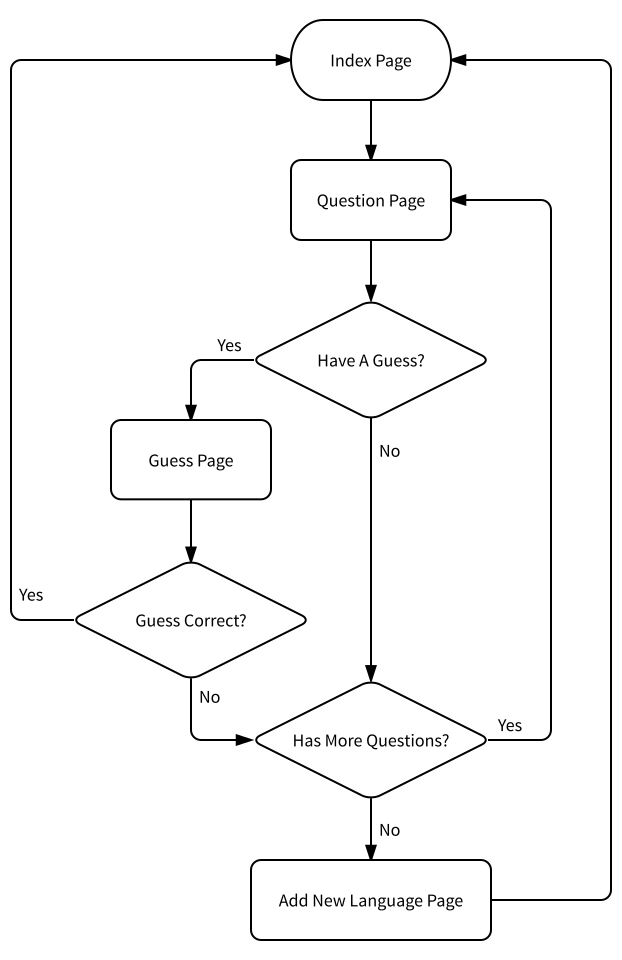

Introduction
============

What is it?
-----------

**Guess Your Favorite Programming Language** is a game where you answer the
question the game askes you, and the game will guess your favorite programming
language. If it can't get the right answer, it can learn from you.

The game flow:

Project Structure
-----------------

This game is implemented using `Flask <http://flask.pocoo.org>`_. And this is
the structure of the project::

   favproglang/
   ├── app
   │   ├── __init__.py
   │   ├── main
   │   │   ├── errors.py
   │   │   ├── forms.py
   │   │   ├── __init__.py
   │   │   └── views.py
   │   ├── models.py
   │   ├── static
   │   └── templates
   │       ├── 404.html
   │       ├── 500.html
   │       ├── base.html
   │       ├── _formhelpers.html
   │       ├── guess.html
   │       ├── index.html
   │       ├── new_language.html
   │       └── question.html
   ├── config.py
   ├── data-dev.sqlite
   ├── data-test.sqlite
   ├── docs
   │   ├── make.bat
   │   ├── Makefile
   │   └── source
   │       ├── apidoc.rst
   │       ├── conf.py
   │       ├── index.rst
   │       ├── intro.rst
   │       ├── license.rst
   │       ├── _static
   │       └── _templates
   ├── LICENSE.mit
   ├── manage.py
   ├── migrations
   │   ├── alembic.ini
   │   ├── env.py
   │   ├── README
   │   ├── script.py.mako
   │   └── versions
   ├── NOTE.md
   ├── README.md
   ├── requirements
   │   ├── dev.in
   │   ├── dev.txt
   │   ├── prod.in
   │   └── prod.txt
   ├── tests
   │   ├── functional_tests.py
   │   ├── __init__.py
   │   ├── test_basics.py
   │   ├── test_errors.py
   │   ├── test_forms.py
   │   ├── test_models.py
   │   └── test_views.py
   └── wiki
       ├── app-flow-chart.svg
       ├── test-progress-app-flow-chart.svg
       └── unit-testing-progress-app-flow-chart.svg

Project Explained
^^^^^^^^^^^^^^^^^

In :mod:`app`, we use :func:`app.create_app` to create instance of the
application, using configuration in :mod:`config`.

API Reference
-------------

See :doc:`apidoc`.

Tests
-----

The tests for this application includes functional tests and unit tests. They
are under the :file:`tests` folder.

Documentation
-------------

The documentation for this application is written in reStructuredText format,
and built using `Sphinx <http://www.sphinx-doc.org>`_.
